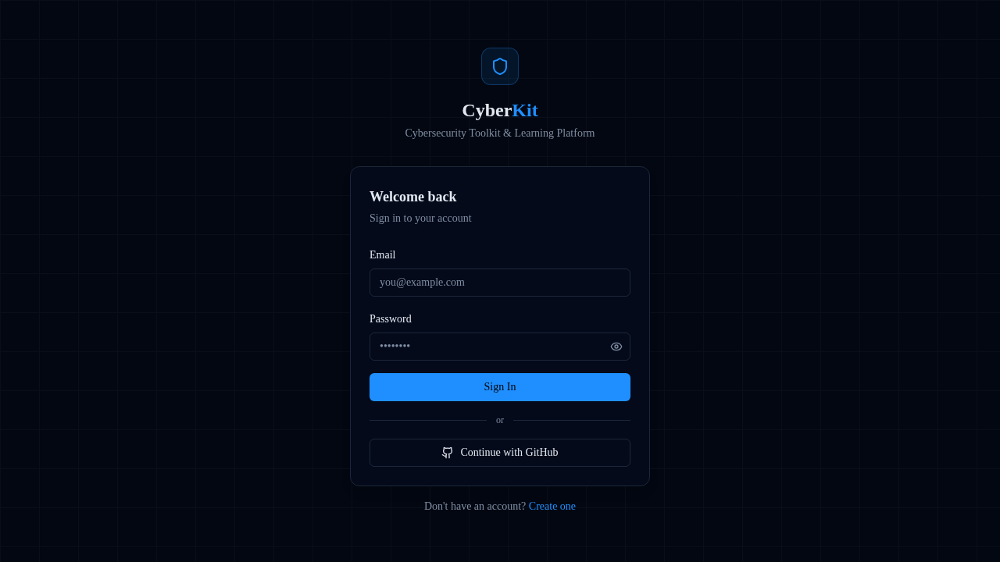
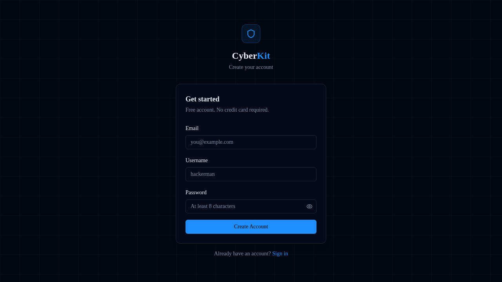

# CyberKit — Cybersecurity Toolkit & Learning Platform

> A full-stack, professional-grade cybersecurity platform built with Next.js 15.  
> Provides 20+ security tools, a structured learning academy, CTF labs, CVE research, scan-report management, and an admin panel — all behind a dark-themed, terminal-inspired UI.

---

## Table of Contents

- [Overview](#overview)
- [Screenshots](#screenshots)
- [Features](#features)
- [Tech Stack](#tech-stack)
- [Directory Structure](#directory-structure)
- [Architecture & How It Works](#architecture--how-it-works)
- [Security Tools Reference](#security-tools-reference)
- [Environment Variables](#environment-variables)
- [Getting Started](#getting-started)
- [Available Scripts](#available-scripts)
- [API Routes](#api-routes)
- [Database Models](#database-models)
- [Authentication & Authorization](#authentication--authorization)

---

## Overview

CyberKit is a comprehensive cybersecurity platform designed for security professionals, ethical hackers, CTF players, and learners. It bundles a wide range of active/passive security tools with a built-in learning academy and report management system, all accessible through a clean, dark-themed web interface.

---

## Screenshots

| Login | Register |
|-------|----------|
|  |  |

---

## Features

| Category | Highlights |
|----------|-----------|
| 🔎 **Reconnaissance** | WHOIS, DNS enumeration (A/AAAA/MX/TXT/NS/CNAME/SOA), Subdomain enumeration |
| 🕷️ **Web Pentesting** | HTTP Headers analysis, SSL/TLS inspector, CORS checker |
| 🌐 **Network** | TCP Port scanner with service detection |
| 🔐 **Crypto & Encoding** | MD5/SHA hashing, Base64/Hex encoder-decoder, JWT analyzer, Password generator & strength meter |
| 🎣 **Phishing Prevention** | URL scanner (heuristic risk scoring), Email content analyzer |
| 🔍 **OSINT** | Username search across platforms, HaveIBeenPwned breach check |
| 🐛 **CVE Research** | Live search against the NVD with CVSS scoring & severity filter |
| 🧪 **Tool Lab** | Classical cipher suite, Steganography toolkit, Digital signature toolkit |
| 📚 **Learning Academy** | Structured courses, CTF labs, roadmaps, progress tracking |
| 📄 **Scan Reports** | Save & manage scan results, generate professional PDF reports |
| 🛡️ **Admin Panel** | Manage users, blog posts, and courses |
| ✍️ **Blog** | Security articles and write-ups |
| ⚙️ **Settings** | User profile and API key management |

### Stats at a glance

- **20+ tools** available
- **6+ courses** in the learning academy
- **6+ CTF labs**
- **200K+ CVEs** indexed via the NVD

---

## Tech Stack

| Layer | Technology |
|-------|-----------|
| Framework | [Next.js 15](https://nextjs.org/) (App Router) |
| Language | TypeScript 5 |
| UI | React 19, Tailwind CSS 3, Radix UI |
| Auth | [NextAuth v5](https://authjs.dev/) (Credentials + GitHub OAuth) |
| Database | MongoDB via [Mongoose 8](https://mongoosejs.com/) |
| Cache / Queues | Redis via [ioredis](https://github.com/luin/ioredis) + [BullMQ](https://bullmq.io/) |
| Real-time | [Socket.IO 4](https://socket.io/) |
| State | [Zustand 5](https://zustand-demo.pmnd.rs/) + [TanStack Query 5](https://tanstack.com/query) |
| Forms | React Hook Form + Zod |
| Crypto | [crypto-js](https://github.com/brix/crypto-js) |
| Icons | [Lucide React](https://lucide.dev/) |
| Runtime scripts | [tsx](https://github.com/privatenumber/tsx) |

---

## Directory Structure

```
CyberKit/
├── app/                         # Next.js App Router root
│   ├── (auth)/                  # Public auth pages
│   │   ├── login/page.tsx
│   │   └── register/page.tsx
│   ├── (dashboard)/             # Protected pages (requires session)
│   │   ├── layout.tsx           # Shared dashboard layout (sidebar + header)
│   │   ├── dashboard/           # Main overview page
│   │   ├── tools/               # All security tool pages
│   │   │   ├── crypto/          # Hashing, encoding, JWT, password tools
│   │   │   ├── cve/             # CVE Research (NVD search)
│   │   │   ├── lab/             # Extended Tool Lab
│   │   │   ├── network/
│   │   │   │   └── portscan/    # TCP Port Scanner
│   │   │   ├── osint/
│   │   │   │   ├── breach/      # HIBP breach check
│   │   │   │   └── username/    # Username search
│   │   │   ├── phishing/        # URL scanner + email analyzer
│   │   │   ├── recon/
│   │   │   │   ├── dns/         # DNS enumeration
│   │   │   │   ├── subdomain/   # Subdomain enumeration
│   │   │   │   └── whois/       # WHOIS lookup
│   │   │   └── web/
│   │   │       ├── cors/        # CORS checker
│   │   │       ├── headers/     # HTTP header analysis
│   │   │       └── ssl/         # SSL/TLS inspector
│   │   ├── learning/
│   │   │   ├── courses/         # Course browser + detail pages
│   │   │   ├── labs/            # CTF labs
│   │   │   └── roadmaps/        # Learning roadmaps
│   │   ├── reports/             # Saved scan reports
│   │   ├── blog/                # Blog + article detail pages
│   │   ├── settings/            # User settings & API keys
│   │   └── admin/               # Admin panel (users, blogs, courses)
│   ├── api/                     # REST API routes (Route Handlers)
│   │   ├── auth/                # NextAuth [...nextauth] + register
│   │   ├── blog/                # Blog CRUD
│   │   ├── reports/             # Report management
│   │   ├── users/               # User management
│   │   ├── admin/               # Admin-only routes
│   │   └── tools/               # Tool backend endpoints
│   │       ├── crypto/
│   │       ├── cve/
│   │       ├── network/portscan/
│   │       ├── osint/
│   │       ├── phishing/
│   │       ├── recon/ (dns, subdomain, whois)
│   │       └── web/ (cors, headers, ssl)
│   ├── globals.css
│   ├── layout.tsx               # Root layout (Providers, Toaster)
│   ├── page.tsx                 # Landing/home page
│   └── providers.tsx            # React context providers
├── components/
│   ├── layout/                  # Sidebar.tsx, Header.tsx
│   ├── tools/                   # ToolLayout.tsx (shared tool wrapper)
│   └── ui/                      # Radix-based design system components
├── hooks/                       # Custom React hooks
├── lib/
│   ├── auth.config.ts           # NextAuth provider configuration
│   ├── auth.ts                  # NextAuth initialisation
│   ├── db/
│   │   ├── connect.ts           # MongoDB connection helper
│   │   └── models/              # Mongoose models
│   │       ├── User.ts
│   │       ├── Blog.ts
│   │       ├── Course.ts
│   │       ├── Report.ts
│   │       ├── ScanResult.ts
│   │       └── UserProgress.ts
│   ├── tools/                   # Server-side tool logic
│   │   ├── crypto/hash.ts
│   │   ├── recon/ (dns.ts, whois.ts)
│   │   └── web/ (headers.ts, ssl.ts)
│   ├── validators/              # Zod schemas
│   └── utils.ts                 # Shared utilities
├── middleware.ts                # NextAuth-based route guard
├── scripts/
│   └── seed-content.ts          # Database seeding script
├── types/
│   └── next-auth.d.ts           # Session type augmentation
├── .env.example                 # Environment variable template
├── next.config.js
├── tailwind.config.ts
└── tsconfig.json
```

---

## Architecture & How It Works

```
Browser (React 19 + Next.js App Router)
         │
         │  HTTP / WebSocket
         ▼
┌────────────────────────────────────────────┐
│            Next.js Middleware              │
│  (middleware.ts — route authentication)   │
└────────────┬───────────────────────────────┘
             │ authenticated
             ▼
┌────────────────────────────────────────────┐
│         App Router (app/)                 │
│                                            │
│  (auth)  ──────────── /login, /register   │
│                                            │
│  (dashboard)  ─── /dashboard              │
│               ─── /tools/*                │
│               ─── /learning/*             │
│               ─── /reports                │
│               ─── /blog/*                 │
│               ─── /settings               │
│               ─── /admin/*                │
└────────────┬───────────────────────────────┘
             │ fetch/POST
             ▼
┌────────────────────────────────────────────┐
│         API Route Handlers (app/api/)     │
│                                            │
│  /api/auth/[...nextauth]  — NextAuth      │
│  /api/tools/recon/dns     — DNS lookup    │
│  /api/tools/recon/whois   — WHOIS         │
│  /api/tools/recon/subdomain               │
│  /api/tools/web/headers   — Headers scan  │
│  /api/tools/web/ssl       — SSL check     │
│  /api/tools/web/cors      — CORS check    │
│  /api/tools/network/portscan              │
│  /api/tools/osint/*       — OSINT         │
│  /api/tools/cve           — NVD search    │
│  /api/reports             — Reports CRUD  │
│  /api/blog                — Blog CRUD     │
└────────────┬───────────────────────────────┘
             │
    ┌────────┴────────┐
    ▼                 ▼
MongoDB           Redis (BullMQ)
(Mongoose)        background jobs /
                  caching
```

### Request lifecycle for a tool scan

1. The user fills in the tool form in the browser and submits.
2. The client page sends a `POST` (or `GET`) request to the corresponding `/api/tools/…` route handler.
3. The API handler calls the relevant library function in `lib/tools/` (e.g., DNS resolver, WHOIS client, SSL checker).
4. If `saveResult: true` is passed, the result is persisted to MongoDB as a `ScanResult` document linked to the authenticated user.
5. The JSON response is returned and rendered in the `ResultCard` component on the page.
6. Users can review all saved results in the **Scan Reports** section.

### Authentication flow

1. Unauthenticated requests to protected paths are intercepted by `middleware.ts`.
2. The middleware uses NextAuth's `auth()` helper to check for a valid session.
3. If no session exists, the user is redirected to `/login`.
4. Login supports **email/password** (Credentials provider, bcrypt hashed) and **GitHub OAuth**.
5. On registration, a new `User` document is created in MongoDB with a hashed password.
6. Session data (user id, role, email) is propagated via the NextAuth JWT strategy and extended in `types/next-auth.d.ts`.

### Background jobs

Heavy or long-running scans (e.g., port scanning, subdomain brute-forcing) are optionally offloaded to **BullMQ** workers backed by Redis, preventing HTTP timeouts and enabling progress streaming via **Socket.IO**.

---

## Security Tools Reference

### 🔎 Reconnaissance

| Tool | Route | API Endpoint | Description |
|------|-------|-------------|-------------|
| WHOIS Lookup | `/tools/recon/whois` | `POST /api/tools/recon/whois` | Domain registration and ownership data |
| DNS Enumeration | `/tools/recon/dns` | `POST /api/tools/recon/dns` | A, AAAA, MX, TXT, NS, CNAME, SOA records |
| Subdomain Enum | `/tools/recon/subdomain` | `POST /api/tools/recon/subdomain` | Discover subdomains via wordlist or DNS brute-force |

### 🕷️ Web Pentesting

| Tool | Route | API Endpoint | Description |
|------|-------|-------------|-------------|
| HTTP Headers | `/tools/web/headers` | `POST /api/tools/web/headers` | Inspect response headers, detect missing security headers |
| SSL Inspector | `/tools/web/ssl` | `POST /api/tools/web/ssl` | Certificate chain, expiry, cipher details |
| CORS Checker | `/tools/web/cors` | `POST /api/tools/web/cors` | Detect permissive CORS misconfigurations |

### 🌐 Network

| Tool | Route | API Endpoint | Description |
|------|-------|-------------|-------------|
| Port Scanner | `/tools/network/portscan` | `POST /api/tools/network/portscan` | TCP port scan with common service identification; supports comma-separated ports or ranges (max 100 ports) |

### 🔐 Crypto & Encoding

All crypto tools live at `/tools/crypto` with hash-based tab navigation:

| Tab Anchor | Tool |
|------------|------|
| (default) | Hash Generator — MD5, SHA-1, SHA-256, SHA-512 |
| `#encode` | Encoder/Decoder — Base64, Hex, URL encoding |
| `#jwt` | JWT Analyzer — decode and inspect JWT tokens |
| `#password` | Password Generator — configurable random password generator |
| `#strength` | Password Strength Analyzer — entropy-based strength scoring |

### 🎣 Phishing Prevention (`/tools/phishing`)

Two tabs powered by client-side heuristic analysis (no external API calls):

- **URL Scanner** — scores URLs for risk signals: non-HTTPS, deep subdomains, punycode lookalikes, URL shorteners, social engineering path keywords, excessive URL length.
- **Email Analyzer** — scans pasted email content for urgency language, credential-harvesting phrases, financial requests, dangerous attachment patterns, and requests for sensitive secrets.

Both return a risk score (0–100) and a labelled list of detected signals.

### 🔍 OSINT

| Tool | Route | Description |
|------|-------|-------------|
| Username Search | `/tools/osint/username` | Check username availability / presence across platforms |
| Breach Check | `/tools/osint/breach` | Query HaveIBeenPwned to check if an email appears in known data breaches (requires `HIBP_API_KEY`) |

### 🐛 CVE Research (`/tools/cve`)

- Live search against the **NIST NVD** API.
- Filter by severity: Critical / High / Medium / Low.
- Displays CVSS score, description, published date, and reference links.
- Set `NVD_API_KEY` in `.env` for higher rate limits (optional).

### 🧪 Tool Lab (`/tools/lab`)

Extended research and educational toolkit including:

- **Classical Cipher Suite** — Caesar, Vigenère, ROT13, and other historical ciphers.
- **Steganography Toolkit** — hide and extract hidden messages in images/text.
- **Digital Signature Toolkit** — sign and verify messages with asymmetric keys.

---

## Environment Variables

Copy `.env.example` to `.env.local` and fill in the values:

```env
# MongoDB connection string
MONGODB_URI=mongodb+srv://<username>:<password>@cluster.mongodb.net/cyberkit

# Redis URL (required for BullMQ job queues)
REDIS_URL=redis://localhost:6379

# NextAuth — generate with: openssl rand -hex 32
NEXTAUTH_SECRET=<32-byte-random-hex-string>
NEXTAUTH_URL=http://localhost:3000

# AES encryption key for stored API key values
ENCRYPTION_KEY=<32-byte-aes-key>

# GitHub OAuth (optional — enables "Sign in with GitHub")
GITHUB_CLIENT_ID=<github-oauth-client-id>
GITHUB_CLIENT_SECRET=<github-oauth-client-secret>

# External API keys (optional — users can also add their own via Settings)
SHODAN_API_KEY=
VIRUSTOTAL_API_KEY=
HIBP_API_KEY=       # Required for Breach Check tool
NVD_API_KEY=        # Recommended for CVE Research (higher rate limits)

# Socket.IO auth secret
SOCKET_SECRET=<socket-auth-secret>

# Public base URL
NEXT_PUBLIC_APP_URL=http://localhost:3000
```

---

## Getting Started

### Prerequisites

- **Node.js** 20+ (or Bun)
- **pnpm** (recommended) — `npm install -g pnpm`
- A running **MongoDB** instance (local or Atlas)
- A running **Redis** instance (local or cloud)

### Installation

```bash
# 1. Clone the repository
git clone https://github.com/Bittu-the-coder/CyberKit.git
cd CyberKit

# 2. Install dependencies
pnpm install

# 3. Configure environment
cp .env.example .env.local
# Edit .env.local with your values

# 4. (Optional) Seed demo content — courses, blogs, roadmaps
pnpm db:seed

# 5. Start the development server
pnpm dev
```

Open [http://localhost:3000](http://localhost:3000) in your browser.

---

## Available Scripts

| Script | Command | Description |
|--------|---------|-------------|
| Development | `pnpm dev` | Start Next.js dev server with hot reload |
| Production build | `pnpm build` | Build the optimised production bundle |
| Start production | `pnpm start` | Serve the production build |
| Lint | `pnpm lint` | Run ESLint across the codebase |
| Seed database | `pnpm db:seed` | Seed courses, blogs, and learning content |
| Background workers | `pnpm workers` | Start BullMQ scan worker process |

---

## API Routes

All tool API routes accept and return JSON. Protected routes require a valid NextAuth session cookie.

### Auth

| Method | Path | Description |
|--------|------|-------------|
| `POST` | `/api/auth/register` | Register a new user |
| `GET/POST` | `/api/auth/[...nextauth]` | NextAuth sign-in/sign-out/session |

### Tools

| Method | Path | Auth | Description |
|--------|------|------|-------------|
| `POST` | `/api/tools/recon/dns` | ✅ | DNS enumeration |
| `POST` | `/api/tools/recon/whois` | ✅ | WHOIS lookup |
| `POST` | `/api/tools/recon/subdomain` | ✅ | Subdomain enumeration |
| `POST` | `/api/tools/web/headers` | ✅ | HTTP header analysis |
| `POST` | `/api/tools/web/ssl` | ✅ | SSL/TLS certificate inspection |
| `POST` | `/api/tools/web/cors` | ✅ | CORS misconfiguration check |
| `POST` | `/api/tools/network/portscan` | ✅ | TCP port scanner |
| `GET` | `/api/tools/cve` | ✅ | CVE search (NVD) |
| `GET/POST` | `/api/tools/osint/*` | ✅ | OSINT tools |
| `GET/POST` | `/api/tools/crypto/*` | ✅ | Crypto utilities |
| `GET/POST` | `/api/tools/phishing` | ✅ | Phishing analysis |

### Content & Management

| Method | Path | Auth | Description |
|--------|------|------|-------------|
| `GET/POST` | `/api/blog` | Public / ✅ | Blog listing and creation |
| `GET/POST/DELETE` | `/api/reports` | ✅ | Scan report management |
| `GET/PATCH/DELETE` | `/api/users` | ✅ Admin | User management |
| `GET/POST/DELETE` | `/api/admin/*` | ✅ Admin | Admin operations |

---

## Database Models

| Model | Collection | Description |
|-------|-----------|-------------|
| `User` | `users` | Account info, hashed password, role (`user` / `admin`), OAuth accounts |
| `ScanResult` | `scanresults` | Saved tool scan output linked to a user |
| `Report` | `reports` | User-generated PDF-ready reports |
| `Course` | `courses` | Learning academy course content |
| `UserProgress` | `userprogresses` | Per-user course/lab completion tracking |
| `Blog` | `blogs` | Blog posts / security articles |

---

## Authentication & Authorization

- **Session strategy**: JWT via NextAuth v5 beta.
- **Providers**: Credentials (email + bcrypt password) and GitHub OAuth.
- **Middleware** (`middleware.ts`) guards all dashboard/tool routes — unauthenticated users are redirected to `/login`.
- **Public paths**: `/`, `/login`, `/register`, `/api/auth/*`, `/api/blog`, `/blog/*`.
- **Role-based access**: Admin routes (`/admin/*` and `/api/admin/*`) additionally require `role === 'admin'` on the session.
- **API key storage**: User-provided external API keys (Shodan, VirusTotal, etc.) are encrypted at rest using AES-256 with the `ENCRYPTION_KEY` environment variable.

---

## Legal Disclaimer

CyberKit is intended for **educational purposes and authorised security testing only**.  
Always obtain explicit written permission before scanning or testing systems you do not own.  
The authors are not responsible for any misuse of the tools provided in this platform.
